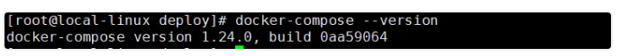
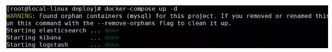
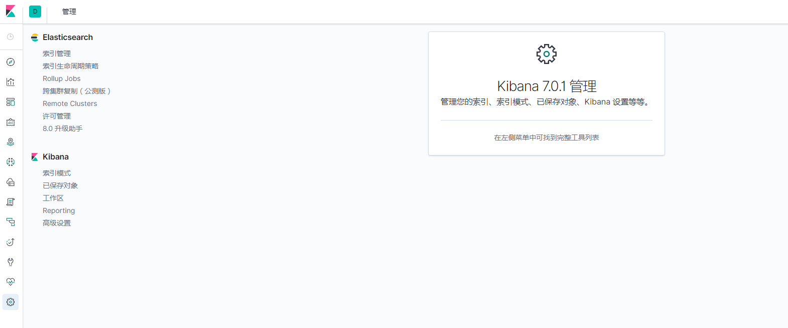

# Elk7.0.1部署

	ELK即Elasticsearch、Logstash、Kibana,组合起来可以搭建线上日志系统，本文主要讲解使用ELK来收集SpringBoot应用产生的日志。

### 参照文章

[使用Docker Compose部署SpringBoot应用](https://mp.weixin.qq.com/s/iMl9bJ4SxUsNHBbiS5VUcw "使用Docker Compose部署SpringBoot应用") 
[SpringBoot应用整合ELK实现日志收集](https://juejin.im/post/5d2738a2f265da1bac404299 "SpringBoot应用整合ELK实现日志收集") 
[使用Docker Compose部署SpringBoot应用](https://mp.weixin.qq.com/s?__biz=MzU1Nzg4NjgyMw==&mid=2247483800&idx=1&sn=b9e0b6c006bad05e4055a3c0bb61c815&scene=21#wechat_redirect "使用Docker Compose部署SpringBoot应用") 
[mall在Linux环境下的部署（基于Docker Compose）](https://mp.weixin.qq.com/s/JYkvdub9DP5P9ULX4mehUw)

### ELK中各个服务的作用
- Elasticsearch:用于存储收集到的日志信息；
- Logstash:用于收集日志，SpringBoot应用整合了Logstash以后会把日志发送给Logstash,Logstash再把日志转发给Elasticsearch；
- Kibana:通过Web端的可视化界面来查看日志。

### 使用Docker Compose 搭建ELK环境
### 安装docker-compose
- 下载Docker Compose:
<pre>curl -L https://get.daocloud.io/docker/compose/releases/download/1.24.0/docker-compose-`uname -s`-`uname -m` > /usr/local/bin/docker-compose</pre>
- 修改该文件的权限为可执行：
<pre>chmod +x /usr/local/bin/docker-compose</pre>
- 查看是否已经安装成功：
<pre>docker-compose --version</pre>

#### 需要下载的Docker镜像(注意:它们的版本号要一致, 不然会报错, 还有为了可以更好支持中文, 我用7.X版本以上)
<pre>docker pull elasticsearch:7.0.1
docker pull logstash:7.0.1
docker pull kibana:7.0.1 </pre>

### 搭建前准备
elasticsearch 启动成功需要特殊配置:

- 需要设置系统内核参数，否则会因为内存不足无法启动
<pre># 改变设置
sysctl -w vm.max_map_count=262144
# 使之立即生效
sysctl -p</pre>
- 需要创建/mydata/elasticsearch/data目录并设置权限，否则会因为无权限访问而启动失败
<pre># 创建目录
mkdir /mydata/elasticsearch/data/
# 创建并改变该目录权限
chmod 777 /mydata/elasticsearch/data</pre>

### 开始搭建
#### 创建一个存放logstash配置的目录并上传配置文件
##### logstash-springboot.conf文件内容(在scripts目录下有此文件)
<pre>
# 输入源
input {
	# rabbitmq配置
    rabbitmq {
      type =>"all"
      durable => true
      exchange => "ex_logstash"
      exchange_type => "direct"
      key => "logstash"
      host => "192.168.1.46:5672"
      user => "guest"
      password => "guest"
      queue => "faceJob-logstash"
      auto_delete => false
      
 }

 rabbitmq {
      type =>"all"
      durable => true
      exchange => "ex_logstash"
      exchange_type => "direct"
      key => "logstash"
      host => "192.168.1.35:5672"
      user => "guest"
      password => "guest"
      queue => "faceJob-logstash"
      auto_delete => false

 }

# 这个springboot的logback-spring.xml另外一个配置方式
  tcp {
    mode => "server"
    host => "0.0.0.0"
    port => 4560
    codec => json_lines
  }
}

# 输出到elasticsearch
output {
  elasticsearch {
    hosts => "192.168.1.36:9200"
	# 第一个参数服务名称, 第二个参数是环境
    index => "%{appName}-%{env}"  
  }
}
</pre>

###创建配置文件存放目录并上传配置文件到该目录
<pre>mkdir /mydata/logstash</pre>
###使用docker-compose.yml脚本启动ELK服务
####docker-compose.yml内容
<pre>version: '3'
services:
  elasticsearch:
    image: elasticsearch:7.0.1
    container_name: elasticsearch
    environment:
      - "cluster.name=elasticsearch" #设置集群名称为elasticsearch
      - "discovery.type=single-node" #以单一节点模式启动
      - "ES_JAVA_OPTS=-Xms512m -Xmx512m" #设置使用jvm内存大小
    volumes:
      - /mydata/elasticsearch/plugins:/usr/share/elasticsearch/plugins #插件文件挂载
      - /mydata/elasticsearch/data:/usr/share/elasticsearch/data #数据文件挂载
    ports:
      - 9200:9200
  kibana:
    image: kibana:7.0.1
    container_name: kibana
    links:
      - elasticsearch:es #可以用es这个域名访问elasticsearch服务
    depends_on:
      - elasticsearch #kibana在elasticsearch启动之后再启动
    environment:
      - "elasticsearch.hosts=http://es:9200" #设置访问elasticsearch的地址
    ports:
      - 5601:5601
  logstash:
    image: logstash:7.0.1
    container_name: logstash
    volumes:
      - /mydata/logstash/logstash-springboot.conf:/usr/share/logstash/pipeline/logstash.conf #挂载logstash的配置文件
    depends_on:
      - elasticsearch #kibana在elasticsearch启动之后再启动
    links:
      - elasticsearch:es #可以用es这个域名访问elasticsearch服务
    ports:
      - 4560:4560
</pre>
###上传到linux服务器并使用docker-compose命令运行
<pre>docker-compose up -d</pre>
注意：Elasticsearch启动可能需要好几分钟，要耐心等待(我的服务器是i7, 所以启动很快)

###在logstash中安装json_lines插件(这个我暂时不知道为什么下载不了, 我是后台开发人员,就没怎么研究了, 谁搞定了, 跟我说一声)
<pre># 进入logstash容器
docker exec -it logstash /bin/bash
# 进入bin目录
cd /bin/
# 安装插件
logstash-plugin install logstash-codec-json_lines
# 退出容器
exit
# 重启logstash服务
docker restart logstash
</pre>
###kibana支持中文界面展示
<pre># 进入logstash容器
docker exec -it kibana /bin/bash
# 进入bin目录
cd config/
# 在文件的最后一行增加(i18n.locale: "zh-CN")	
vi kibana.yml
	#
	# ** THIS IS AN AUTO-GENERATED FILE **
	#

	# Default Kibana configuration for docker target
	server.name: kibana
	#server.host: "0"
	server.host: "localhost"
	elasticsearch.hosts: [ "http://elasticsearch:9200" ]
	xpack.monitoring.ui.container.elasticsearch.enabled: true
	i18n.locale: "zh-CN"
# 退出容器
exit
# 重启logstash服务
docker restart kibana
</pre>
###开启防火墙并在kibana中查看
<pre>systemctl stop firewalld</pre>
访问地址：http://自己的ip:5601

###SpringBoot应用集成Logstash
###在pom.xml中添加logstash-logback-encoder依赖
	<!--集成logstash-->
	<dependency>
	    <groupId>net.logstash.logback</groupId>
	    <artifactId>logstash-logback-encoder</artifactId>
	    <version>5.3</version>
	</dependency>
###添加配置文件logback-spring.xml让logback的日志输出到logstash
###input使用的tcp,用以下的配置
<pre>注意appender节点下的destination需要改成你自己的logstash服务地址，比如我的是：自己的ip:4560 </pre>
	<?xml version="1.0" encoding="UTF-8"?>
	<!DOCTYPE configuration>
	<configuration>
	    <include resource="org/springframework/boot/logging/logback/defaults.xml"/>
	    <include resource="org/springframework/boot/logging/logback/console-appender.xml"/>
	    <!--应用名称-->
	    <property name="APP_NAME" value="mall-admin"/>
	    <!--日志文件保存路径-->
	    <property name="LOG_FILE_PATH" value="${LOG_FILE:-${LOG_PATH:-${LOG_TEMP:-${java.io.tmpdir:-/tmp}}}/logs}"/>
	    <contextName>${APP_NAME}</contextName>
	    <!--每天记录日志到文件appender-->
	    <appender name="FILE" class="ch.qos.logback.core.rolling.RollingFileAppender">
	        <rollingPolicy class="ch.qos.logback.core.rolling.TimeBasedRollingPolicy">
	            <fileNamePattern>${LOG_FILE_PATH}/${APP_NAME}-%d{yyyy-MM-dd}.log</fileNamePattern>
	            <maxHistory>30</maxHistory>
	        </rollingPolicy>
	        <encoder>
	            <pattern>${FILE_LOG_PATTERN}</pattern>
	        </encoder>
	    </appender>
	    <!--输出到logstash的appender-->
	    <appender name="LOGSTASH" class="net.logstash.logback.appender.LogstashTcpSocketAppender">
	        <!--可以访问的logstash日志收集端口-->
	        <destination>自己的ip:4560</destination>
	        <encoder charset="UTF-8" class="net.logstash.logback.encoder.LogstashEncoder"/>
	    </appender>
	    <root level="INFO">
	        <appender-ref ref="CONSOLE"/>
	        <appender-ref ref="FILE"/>
	        <appender-ref ref="LOGSTASH"/>
	    </root>
	</configuration>
###input使用的rabbitmq,用以下的配置
	<?xml version="1.0" encoding="UTF-8"?>
	<configuration scan="true" scanPeriod="30 seconds" debug="false">
	    <include resource="org/springframework/boot/logging/logback/defaults.xml"/>
	    <include resource="org/springframework/boot/logging/logback/console-appender.xml"/>
	    <property name="log.path" value="/logs"/>
	
	    <springProperty scop="context" name="logName" source="spring.application.name" defaultValue="platform-log"/>
	    <springProperty scop="context" name="rabbit.host" source="spring.rabbitmq.host" defaultValue="192.168.1.35"/>
	    <springProperty scop="context" name="rabbit.port" source="spring.rabbitmq.port" defaultValue="5672"/>
	    <springProperty scop="context" name="rabbit.username" source="spring.rabbitmq.username" defaultValue="guest"/>
	    <springProperty scop="context" name="rabbit.password" source="spring.rabbitmq.password" defaultValue="guest"/>
	
	    <contextName>${AppName}</contextName>
	
	    <conversionRule conversionWord="clr" converterClass="org.springframework.boot.logging.logback.ColorConverter"/>
	    <conversionRule conversionWord="wex"
	                    converterClass="org.springframework.boot.logging.logback.WhitespaceThrowableProxyConverter"/>
	    <conversionRule conversionWord="wEx"
	                    converterClass="org.springframework.boot.logging.logback.ExtendedWhitespaceThrowableProxyConverter"/>
	    <property name="CONSOLE_LOG_PATTERN"
	              value="${CONSOLE_LOG_PATTERN:-%clr(%d{yyyy-MM-dd HH:mm:ss.SSS}){faint} %clr(${LOG_LEVEL_PATTERN:-%5p})
	              %clr(${PID:- }){magenta} %clr(---){faint} %clr([%15.15t]){faint} %clr(%-100.100logger{390}){cyan}
	              %clr(:){faint} %m%n${LOG_EXCEPTION_CONVERSION_WORD:-%wEx}}"/>
	
	    <appender name="CONSOLE" class="ch.qos.logback.core.ConsoleAppender">
	        <!--
	        此日志appender是为开发使用，只配置最底级别，
	        控制台输出的日志级别是大于或等于此级别的日志信息
	        -->
	        <!--
	       <filter class="ch.qos.logback.classic.filter.ThresholdFilter">
	           <level>debug</level>
	       </filter>
	       -->
	        <encoder>
	            <Pattern>${CONSOLE_LOG_PATTERN}</Pattern>
	            <charset>UTF-8</charset>
	        </encoder>
	    </appender>
	
	    <appender name="AMQP" class="org.springframework.amqp.rabbit.logback.AmqpAppender">
	        <!-- encoder必须要有，是logback和logstash的纽带 -->
	        <encoder charset="UTF-8" class="net.logstash.logback.encoder.LogstashEncoder">
	            <!-- 用户自定义Json字符串，用于向logstash提交额外的自定义属性。可在logstash的input里接收该参数 -->
	            <customFields>{"appName":"${logName}", "env":"${SPRING_PROFILES_ACTIVE}"}</customFields>
	        </encoder>
	        <host>${rabbit.host}</host>
	        <port>${rabbit.port}</port>
	        <username>${rabbit.username}</username>
	        <password>${rabbit.password}</password>
	        <routingKeyPattern>logstash</routingKeyPattern>
	        <declareExchange>false</declareExchange>
	        <exchangeType>direct</exchangeType>
	        <exchangeName>ex_logstash</exchangeName>
	        <generateId>true</generateId>
	        <charset>UTF-8</charset>
	        <durable>true</durable>
	        <deliveryMode>NON_PERSISTENT</deliveryMode>
	    </appender>
	
	    <logger name="com.jnb" level="DEBUG"/>
	
	    <!--输出到logstash的appender-->
	    <!--<appender name="LOGSTASH" class="net.logstash.logback.appender.LogstashTcpSocketAppender">-->
	        <!--&lt;!&ndash;可以访问的logstash日志收集端口&ndash;&gt;-->
	        <!--<destination>192.168.1.46:4560</destination>-->
	        <!--<encoder charset="UTF-8" class="net.logstash.logback.encoder.LogstashEncoder"/>-->
	    <!--</appender>-->
	
	    <logger name="org.springframework.security" level="DEBUG"/>
	
	    <root level="INFO">
	        <appender-ref ref="CONSOLE"/>
	        <appender-ref ref="AMQP"/>
	        <!--<appender-ref ref="LOGSTASH"/>-->
	    </root>
	
	</configuration>

