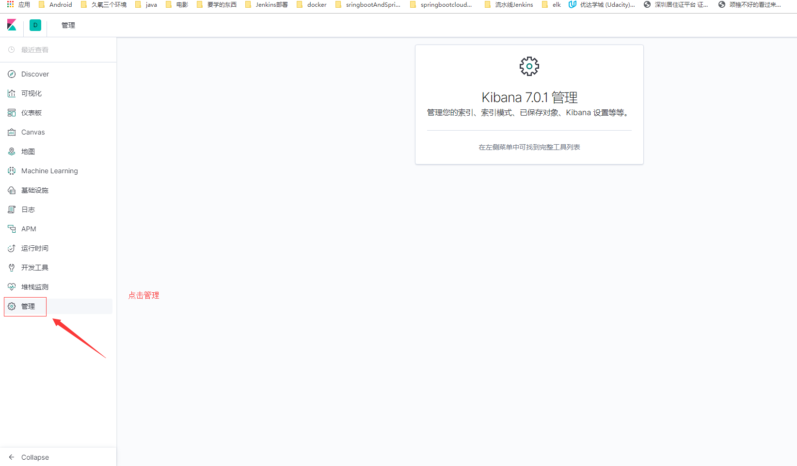
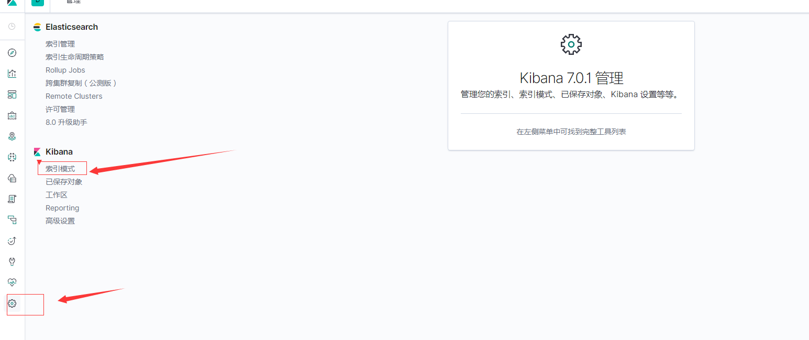
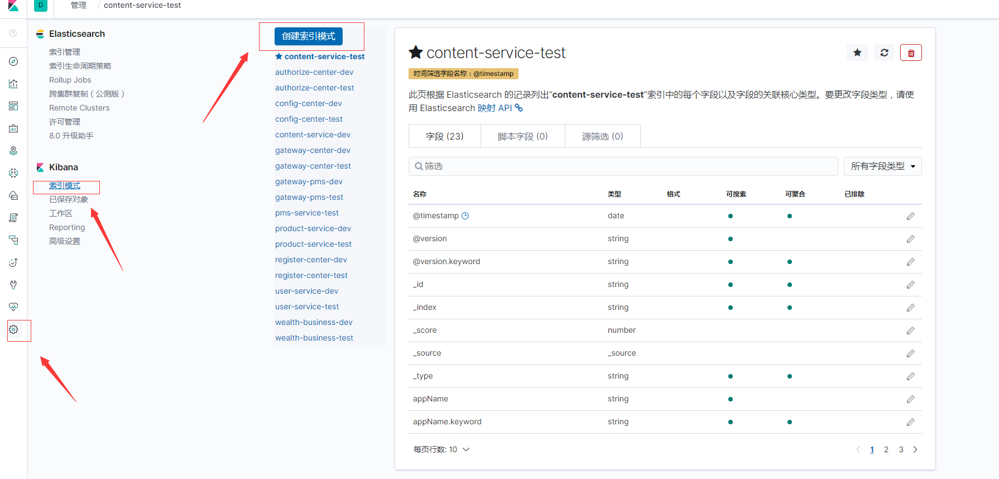
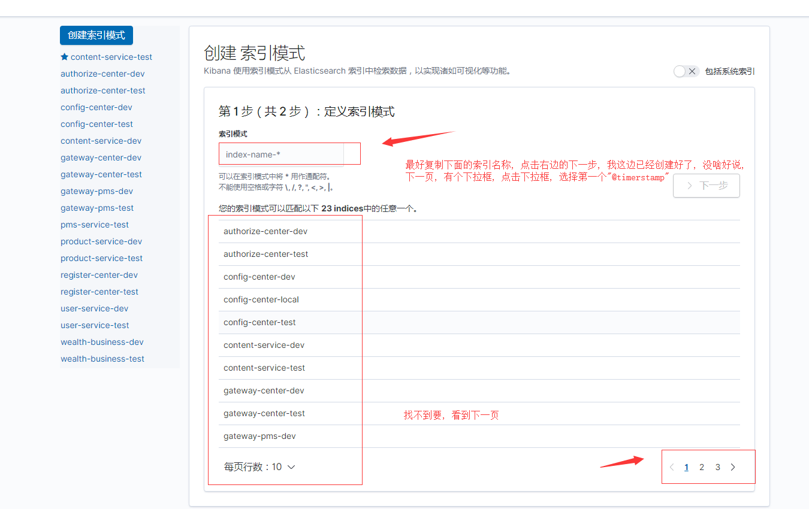
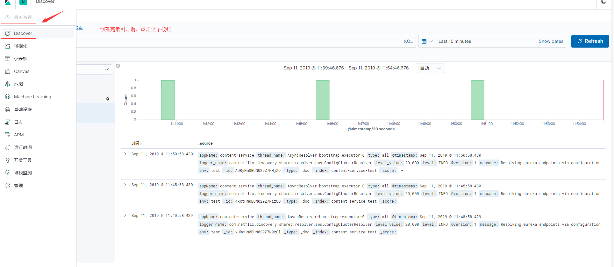
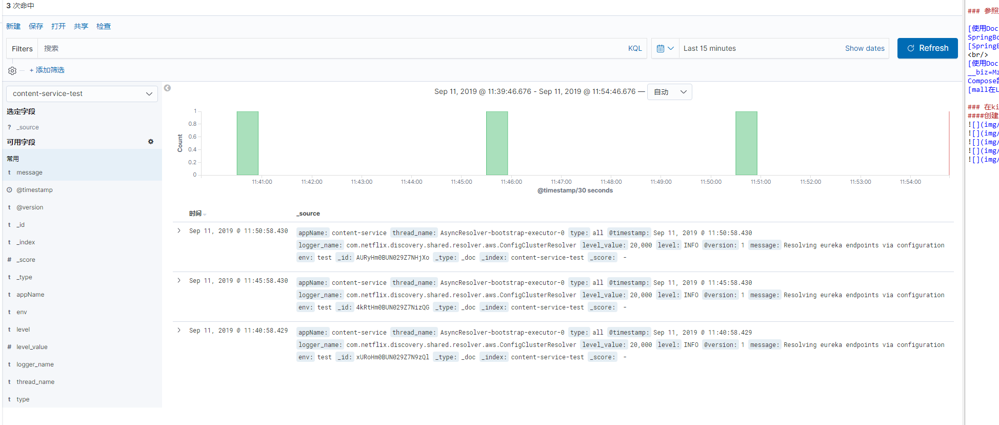

# Elk7.0.1使用篇

	ELK即Elasticsearch、Logstash、Kibana,组合起来可以搭建线上日志系统，本文主要讲解使用ELK来收集SpringBoot应用产生的日志。

### 参照文章

[使用Docker Compose部署SpringBoot应用](https://mp.weixin.qq.com/s/iMl9bJ4SxUsNHBbiS5VUcw "使用Docker Compose部署SpringBoot应用") 
[SpringBoot应用整合ELK实现日志收集](https://juejin.im/post/5d2738a2f265da1bac404299 "SpringBoot应用整合ELK实现日志收集") 
[使用Docker Compose部署SpringBoot应用](https://mp.weixin.qq.com/s?__biz=MzU1Nzg4NjgyMw==&mid=2247483800&idx=1&sn=b9e0b6c006bad05e4055a3c0bb61c815&scene=21#wechat_redirect "使用Docker Compose部署SpringBoot应用") 
[mall在Linux环境下的部署（基于Docker Compose）](https://mp.weixin.qq.com/s/JYkvdub9DP5P9ULX4mehUw)

### 在kibana中查看日志信息
####创建index pattern

